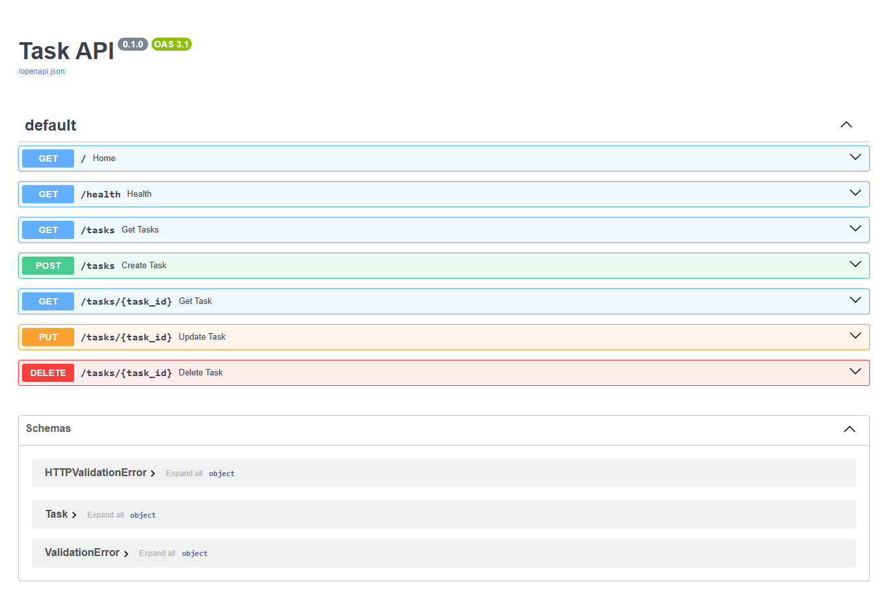

# Task API

A simple CRUD API built with FastAPI that performs Create, Read, Update, and Delete (CRUD) operations on an in-memory task list.

## Features

- Create Task
- Read All Tasks
- Read Single Task
- Update Task
- Delete Task
- Health Check Endpoint
- Swagger UI Documentation

## Installation

```bash
pip install -r requirements.txt
```

## Run

```bash
uvicorn main:app --reload
```

## API URLs

- API: http://127.0.0.1:8000
- Swagger UI: http://127.0.0.1:8000/docs

## Endpoints

| Method | Endpoint | Description |
|--------|----------|-------------|
| GET | / | API Information |
| GET | /health | Health Check |
| GET | /tasks | Get All Tasks |
| GET | /tasks/{task_id} | Get Single Task |
| POST | /tasks | Create Task |
| PUT | /tasks/{task_id} | Update Task |
| DELETE | /tasks/{task_id} | Delete Task |

## Example cURL

```bash
curl -X GET http://127.0.0.1:8000/tasks
```

### Sample Output

```json
[
  {
    "id": 1,
    "title": "Learn FastAPI",
    "done": false
  }
]
```

## Swagger UI Screenshot



## Author

Sobia Liaqat